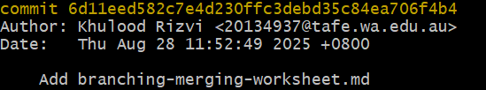
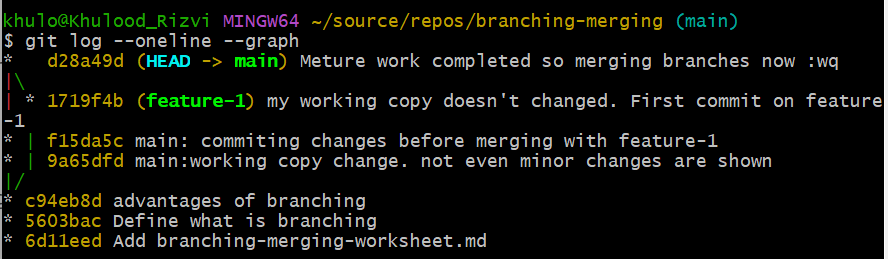

# What I learned about branching and merging

> Use the attached worksheet to practice the concepts of branching and merging. 

Actions you need to perform are marked with `- [ ]` replace the space with an `x` when you complete the action.

x Before you start, create a new git repo and add the worksheet to it:

```bash
cd source/repos
mkdir branching-merging
cd branching-merging
git init
cp ~/Downloads/branching-merging-worksheet.md .
git add .
git commit -m "Add branching-merging-worksheet.md"
```


## Branching

### Definition

x In your own words define what is branching

> A branching is just like a tree branch which is intact with tree but growing its own leaves and flowers. 
Similarly, branch in version control system is like a part of a project but isolated to work on new feature or bug fixes so other people working on main would not get interrupte.

X Commit your changes:

```bash
git add .
git commit -m "Define what is branching"
```


### Why branch

x List at least three reasons why you would use branches in a project

Reasons are:
1.For bug fixing
2.For new feature
3.to revert to previous/old version of project in case of failure.

X Commit your changes - remember to use a descriptive message

### How to create a branch

To create a branch we run the following commands: 

```bash
git branch <branch-name>
git switch <branch-name>
```


- [ ] Briefly describe what each command does:

> git branch <branch-name> will create a new branch.Throw warning if already exist.
> git switch <branch-name> will switch the current working node/branch to be <branch-name>

- [ ] Create a new branch called `feature-1` and switch to it
- [ ] Did your working copy change? Why or why not?

> No, working copy doesn't change

x Commit your changes
x  Switch back to main
x  Did you notice any changes in the working copy after the commit? Why or why not?

> yes my working copy not even showing the minor changes i made, before switching to feature.
  Since I didn't commit but create and switch to new branch so feature-1 carries forward the changes
 
**Oh no!** 
If you did everything correctly, your answer to the previous question is gone! Haha.

Don't worry, we can get it back. But first:

x Commit your changes to the main branch


### Merging changes

x What is merging?
> combining files/ directories so that you have combined file(s) from all branches

x What is a merge conflict?
> If the same file contains different text, even different in layout and design then git 
> arise confilt between them while merging.

When there is a merge conflict, you need to resolve it before you can merge the changes. Git will mark the conflicted files, and you need to manually resolve the conflicts – that is, edit the files to remove the conflict markers and make the changes you want to keep. Here's an example of a file with a merge conflict:

```text
<<<<<<< HEAD
Text from the version in the HEAD (main) branch
=======
Text from the version in the feature-1 branch
>>>>>>> feature-1
```


X How do you resolve a merge conflict?
> by checking and resolving merge conflict between the same file between branches.

X Attempt to merge the `feature-1` branch into `main`:

```bash
git merge feature-1
```

X Did it work? Why or why not?

> It didn't merge as i didnt stage the changes in branching-merging-worksheet.md and commit 
> it, so its throwing an error of overwritten

Before you can merge, you need to commit any changes in your working copy (or stash, but we'll talk about that later)

x Commit your changes
x Attempt to merge the `feature-1` branch into `main` again
x Did it work? Why or why not? If a merge succeeded, what was the merge strategy used? If there was a merge conflict, resolve it.
  
> yes it worked. If there is a merged conflict then resolve it

x Commit your changes and/or resolve the merge conflict

### Deleting branches

- [ ] Delete the `feature-1` branch:
```bash
git branch -d feature-1
```

### Looking back

We can look into the past and see the evolution of our project using the git log command. There are several useful options to the git log command, such as --oneline, --graph, --decorate, --all, --since, --until, --author, --grep, --no-merges, --reverse, and many others.

We'll use a couple of popular options to see the history of our project.

X Run the following commands:

```bash 
git log
git log --oneline
git log --oneline --graph --decorate --all
```
X Briefly describe the output of each command

> git log: shows all the log since the project/repo is created.If screen is small then
pressing enter is to show more lines.Detailed description like author, time is shown with
messages
 
> git log --oneline : one line info of commit messages are shown
> git log --online --graph --decorate --all



x Commit your changes
x Reflect on what you learned about branching and merging. What was the most challenging part? What was the most interesting part?

> Your reflection goes here

**Done!**
Or are you? There are always new changes to commit ;) 